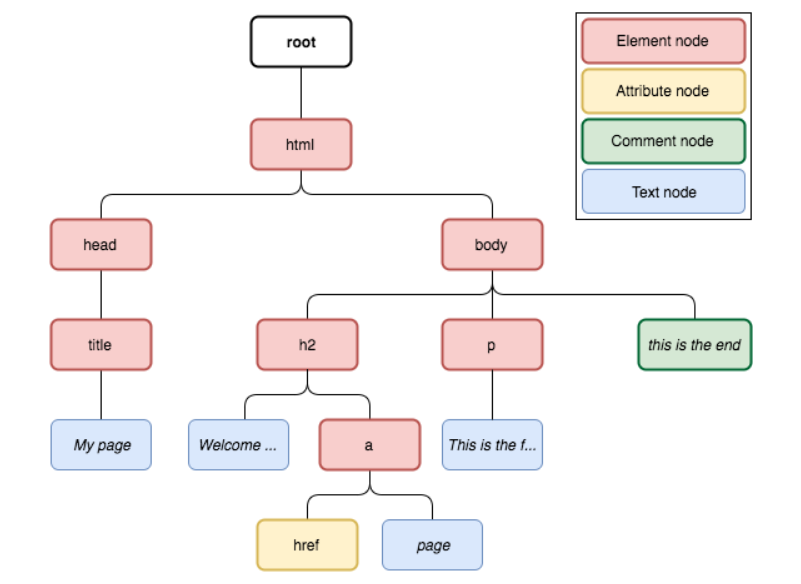

# XPath basics

XPath - XML Path language. XPath can be used to traverse through XML and HTML tree using path like (unix) syntax.

## XPath node types



XPath has a implicit root node that is the root of all the elements in the XML/HTML document(This root is represented using first `/` similar to the way root directory is referenced in a unix path).

Most common XPath node types are (remember as CEAT)

* **C**omment node
* **E**lement node
* **A**ttribute node - Contains the attribute value.
* **T**ext node

Other nodes types are

* Namespace node
* processing-instruction node
* document node

## XPath Location step

XPath of the form `/html/head/title` are referred to as **location paths**.
Location path of the form `/step/step/...` can be split into multiple **location steps**. Syntax of each location step is `axisname::nodetest[predicate]`. Each step consists of

* an **axis** that defines the tree-relationship between the selected nodes and the current node
* a **node-test** that identifies a node within an axis
* zero or more **predicates** to further refine the selected node-set)

**NOTE**: Whitespace within XPath is ignored `/  head/   html/title` is same as `/head/html/title`. So we can indent longer xpaths for readability.

## Axis and node test

* `//title` - Select all nodes named `title` from anywhere in the hierarchy from the root node.

> The **axis** defines where in the tree the **node test** should be applied and the nodes that match the node test will be returned as a result.

```xpath
<!-- descendant-or-self and child are axes in this path -->
<!-- node and title are node tests in this path -->
/descendant-or-self::node()/child::title
```

* Axis defines the direction on which the node test needs to be applied. In a tree structure, we can move upwards (parents and ancestors), downwards (child, descendants) and on the same tree level(siblings).

```text
# Reference: https://www.w3.org/TR/2017/REC-xpath-31-20170321/#axes

ForwardAxis     ::=     ("child" "::")
| ("descendant" "::")
| ("attribute" "::")
| ("self" "::")
| ("descendant-or-self" "::")
| ("following-sibling" "::")
| ("following" "::")
| ("namespace" "::")  

ReverseAxis     ::=     ("parent" "::")
| ("ancestor" "::")
| ("preceding-sibling" "::")
| ("preceding" "::")
| ("ancestor-or-self" "::")  
```

## Node selection

Path starting with single `/` is considered as absolute path and starts from XPath root element. Relative path usage is recommended.

* `//` - Selects nodes in the document from the current node that match the selection.
* `.` - Represents current node
* `..` - represents the parent node

Examples

* `/html/head` - Select `head` node under `html` node
* `//h2/a` - Selects **all** `a` nodes under all of the  `h2` nodes in the document(current node is h2).
* `//script` - Selects all `script` nodes anywhere within the document(implicitly root is assumed as the starting point).
* `/html/body//script` - Selects all `script` nodes anywhere within the `body` node.

## Node test expression

* `//comment()` - Selects only comment nodes.
* `//node()` - Selects any kind of node in the tree.
* `//text()` - Selects only text nodes
* `//attribute()` - Selects all the attribute nodes which contains the attribute values.
* `//element()` - Selects all the elements in the document along with the body of each element.
* `//*` -  Selects all nodes, except comment and text nodes. In other words, `*` selects all element nodes, text and comments are not elements and so are attributes.
* `//@*` - Selects any attribute node.

## Predicate

* Predicate is defined inside `[]`. This is used to select elements defined before the predicate, if the predicate is satisfied.

* **Positional predicates** `//li[position() = 1]` or `//li[1]` - Selects the first `li` node in each of the `ul` or `ol` lists in the document.
* In case of lists, XPath position index **starts from 1 and not 0**.

* **Conditional predicates**: Relational operators `<, >, =, !=, <=, >=` can be used in predicates.
* Logical operators `or`, `and` are availabe.
* Arithmetic operators `+, -, *, mod(or)%, div` are available.

* **Location path predicates** - `//table/tr[ td/a ]`

Examples

* `//li[position()%2=0]` -  Selects the `li` elements at even positions.
* `//li[a]` - Selects the `li` elements which enclose an `a` element.
* `//li[a or h2]`  Selects the `li` elements which enclose either `a` or `h2`
* `//li[ a [ text() = "link"]]`(nested predicates) or `//li[a/text()="link"]` - Selects the `li` elements which enclose an `a` element whose text is "link". Here the predicates are read from innermost one to outer most one to make sense.
* `//li[last()]`  Selects the last `li` element in each of ordered and unordered lists in the document.
* `//p[@*]` - Selects all `p` nodes with atleast 1 attribute.

Comparisons can be used directly against the node instead of `node/text()`. Assume book contains title, year and price.

* `/bookstore/book[price/text() > 35]/price`, `/bookstore/book[price > 35]/price`, `/bookstore/book/price[text() > 35]` all return prices of book that costs more than 35. Notice the predicate `price > 35` where node is directly compared.
* `/bookstore/book[title="Harry Potter"]`, `/bookstore/book[title [ text() = "Harry Potter"]]`, `/bookstore/book[title/text() = "Harry Potter"]`

* You can have multiple predicates in sequence per step as in `axis::nodetest[predicate#1][predicate#2][predicate#3]...` and these predicates are processed in order from left to right. Output of predicate is fed to another.
  * `//div[@class="second"][2]` - Select all div nodes with class attribute of value `second` and from that list select the second node.
  * `//div[2][@class="second"]` - Select all the divs which are 2nd child of their parent from `descendant-or-self` and then select those with class attribute value `second`.

**NOTE**:  The position is relative to the node-set processed by the previous predicate.

## Union of XPaths

* Multiple XPaths can be joined using `|` union. This can be used to select nodes from several paths.
* `//a | //h2` - Selects all `a` and `h2` nodes in the document.

## Attribute access

* Node attributes are accessed using the syntax `@attribute_name`

* `//a[starts-with(@href, "https")]` - Select all `a` nodes whose `href` attribute value starts with **https**
* `//a[@href="https://scrapy.org"]` - Selects all `a` nodes whose `href` value matches the given URL.
* `//a/@href` - Selects all the href attribute values
* `//li[@id]` - Select all `li` nodes with an id attribute

## Using Axis

First select the node(`h1`, `div[@id="footer"]`) from where you want to move your axis.

* `//h1/following-sibling::p[1]` - Selects the first paragraph node following `h1` node

* `//div[@id="footer"]/preceding-sibling::text()[1]` - Selects the text node that is an immediate preceding sibling(indicated by 1) to the `div` with `id="footer"`. If we use 2, then it will select the text node(if any) which is the second sibling preceding it.

* `//*[p/text()="Footer text"]` - Selects all the parent nodes(any node) which contain a `p` node with text **Footer text**. `//p[ text()="Footer text" ]/..` xpath also does the same. Notice `..` is used to fetch the parent. `//p[text()="Footer text"]/parent::node()`, `//p[text()="Footer text"]/parent::element()` also achieve the same results.

## XPath useful functions

* `string(xpath_expression)` - will concatenate all text content from the selected node and all of its children, recursively, effectively stripping HTML tags. **XPath expression should always return only one node for `string()` to work**. In other words node set size should be 1. That node can have a whole lot of other nodes nested inside it.

* `normalize-space(string)` - removes leading and trailing whitespaces. Equivalent to `trim` or `strip`

* `count(xpath_expression)` - `count(//p)` - returns the count of `p` nodes in the document. `count(//@*)` - count of all the attributes in the document.

* `count(//p) = 2` - This expression returns a boolean value. This expression can be **used as a predicate to select the node** satisfying this predicate.

## Relative vs Absolute path

```Python
for div in doc.xpath('//body//div'):
    # //p is absolute path. returns same nodes for all divs.
    print(div.xpath('//p'))

# output
# [(1) '<p>This is a paragraph.</p>'
#  (2) '<p>Is this <a href="page2.html">a link</a>?</p>']
# [(1) '<p>This is a paragraph.</p>'
#  (2) '<p>Is this <a href="page2.html">a link</a>?</p>']
# [(1) '<p>This is a paragraph.</p>'
#  (2) '<p>Is this <a href="page2.html">a link</a>?</p>']

# =========================================================
# Using relative path
for div in doc.xpath('//body//div'):
    # find all p nodes inside current div node
    print(div.xpath('./p'))

# Output
# []
# [(1) '<p>This is a paragraph.</p>'
#  (2) '<p>Is this <a href="page2.html">a link</a>?</p>']
# []
```

## Abbreviated syntax and full syntax

* `//div/div[@class="second"]` - `/descendant-or-self::node() /child::div /child::div [attribute::class = "second"]`

## Using axes for moving around

* `self`
* `parent`, `child` - moving 1 level up or down the tree
* `ancestor`, `ancestor-or-self` - Multihop upwards
* `descendant`, `descendant-or-self` - Multihop downwards
* `following`, `preceding` - All nodes above or below the selected node. Follows document order. `preceding` will not consider ancestors and `following` will not consider descendants.
* `preceding-sibling`, `following-sibling` - Moving up and down in the same level
* `attribute`, `namespace` -non elements

> “The ancestor, descendant, following, preceding and self axes partition a document(ignoring attribute and namespace nodes): they do not overlap and together they contain all the nodes in the document."
---

## References

* [An Introduction to XPath](https://blog.scrapinghub.com/2016/10/27/an-introduction-to-xpath-with-examples)
* [Xpath](https://scrapinghub.github.io/xpath-playground/?utm_campaign=BRA&utm_activity=BLO&utm_medium=ORG&utm_source=HUB&utm_content=BLP)
* [XPath Axes](https://www.w3schools.com/xml/xpath_axes.asp)
* [XPath Tutorial](https://docs.scrapy.org/en/xpath-tutorial/topics/xpath-tutorial.html)
